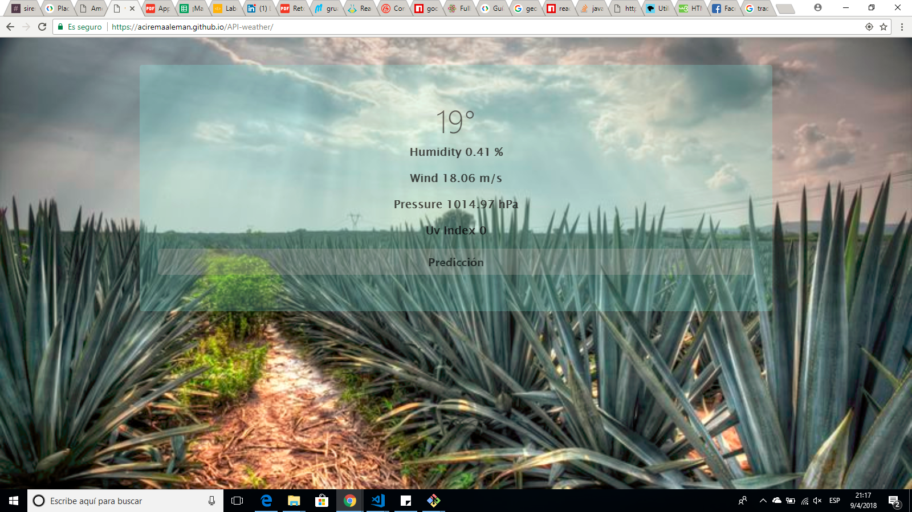
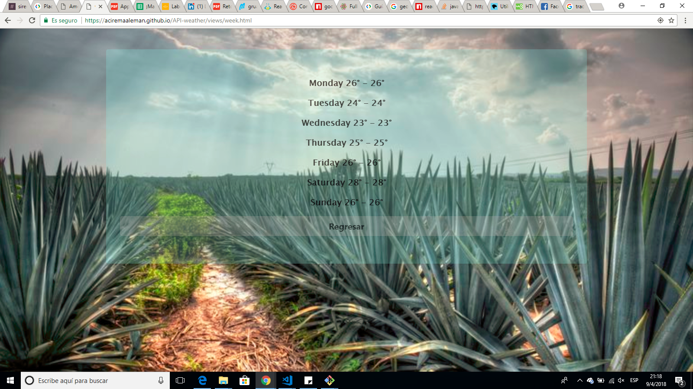

# API-weather

# In this project I used Dark Sky Api

https://darksky.net/dev

The dark sky api show the weather in this case in Celsius degrees and some other characteristics, humidity, wind speed, pressure, uv index and also the weather prediction of the week.

The challenge of the api was how to enter the data and going through the data to obtain the specific data like humidity.

In this project i used jquery and the method ajax to enter de data of the api. For the design i used the framework of css Bootstrap 6.s

Project made for laboratoria
